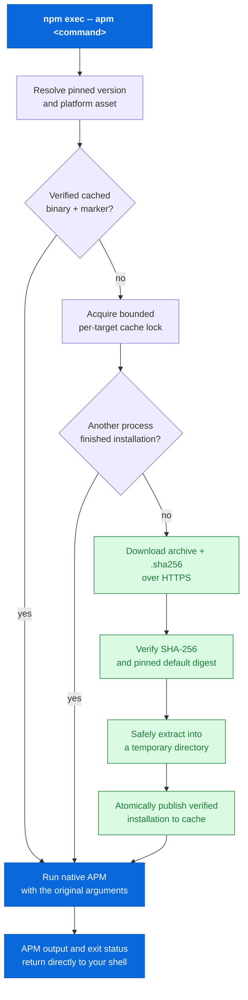

<div align="center">

# `@mgrilec/apm`

**A verified npm launcher for the [Microsoft APM CLI](https://github.com/microsoft/apm).**

Install it once; on first use, it securely fetches the matching native APM release, verifies it, caches it, and runs it.

[](https://github.com/mgrilec/apm/actions/workflows/ci.yml)
[](https://www.npmjs.com/package/@mgrilec/apm)
[](https://nodejs.org/)
[](LICENSE)

[Install](#1-installation) · [How it works](#2-how-it-works) · [Configuration](#3-configuration) · [Supported targets](#4-supported-targets) · [Security model](#5-security-model) · [Troubleshooting](#6-troubleshooting) · [Recipes](#7-recipes) · [Development](#8-development) · [Publishing](#9-publishing) · [Support](#10-support-and-license)

</div>

> [!IMPORTANT]
> This is an independent wrapper and is not affiliated with or endorsed by Microsoft. Microsoft APM itself is MIT-licensed by Microsoft.

## 1. Installation

### 1.1 Requirements

- Node.js 20 or later.
- npm 10 or later (bundled with Node 20); pnpm / yarn / bun also work as long as they run `node` for the launcher's bin entry.
- Outbound HTTPS access to `github.com` (or to `MICROSOFT_APM_DOWNLOAD_BASE_URL` if you use a mirror) on the first invocation for a given target.
- Git on `PATH` for any Microsoft APM command that operates on git repositories (this is an APM requirement, not a launcher requirement).

The launcher is published as a CommonJS package with no native binding; nothing to compile.

### 1.2 Why this package?

Microsoft APM ships native binaries. This package makes the CLI available through the normal npm workflow without hiding the provenance of the binary that actually runs.

- **Pinned by default** — installs Microsoft APM **0.29.0**, so an upstream release cannot silently change an existing npm installation.
- **Verified before execution** — downloads the archive and its upstream SHA-256 sidecar over HTTPS; supported releases are additionally checked against digests embedded in this package.
- **Cached per platform and version** — only the first run for a given target needs a download.
- **Transparent at the command line** — APM arguments, output, exit code, and signals pass through unchanged.
- **Safe for concurrent first runs** — a bounded cache lock ensures one installation wins cleanly.

### 1.3 Quick start

```sh
npm install --save-dev @mgrilec/apm
npm exec -- apm --version
npm exec -- apm install microsoft/apm
```

For repeated use, add a script to `package.json`:

```json
{
  "scripts": {
    "apm": "apm"
  },
  "devDependencies": {
    "@mgrilec/apm": "^0.1.0"
  }
}
```

Then invoke any upstream command through npm:

```sh
npm run apm -- --version
npm run apm -- install microsoft/apm
```

### 1.4 Verifying the install

```sh
npm exec -- apm --version
npm exec -- apm --help
```

`apm --version` prints the upstream binary's self-reported version; it should equal the package's pinned `0.29.0` (or whatever you set `MICROSOFT_APM_VERSION` to). If it prints a different version unexpectedly, see [§6 Troubleshooting](#6-troubleshooting).

### 1.5 Uninstall

To remove the wrapper:

```sh
npm uninstall @mgrilec/apm
```

To remove cached binaries as well, delete the cache directory. Its default location depends on the platform:

- `%LOCALAPPDATA%\microsoft-apm` on Windows when `LOCALAPPDATA` is set.
- `$XDG_CACHE_HOME/microsoft-apm` when `XDG_CACHE_HOME` is set.
- `~/.cache/microsoft-apm` otherwise.

Override it with `MICROSOFT_APM_CACHE_DIR` if you changed the default at install time.

## 2. How it works

The wrapper is intentionally small: it owns installation and verification; the downloaded native APM binary owns every normal APM command.



<details>
<summary><strong>Step-by-step flow</strong> — fallback for renderers without Mermaid</summary>

1. The launcher rejects `apm self-update`, because it would replace the verified binary.
2. It resolves an explicit Microsoft APM version and the native asset for the current platform.
3. A usable cached installation is run immediately. Otherwise, concurrent launchers coordinate through a bounded lock.
4. The winning launcher downloads the release archive and adjacent checksum sidecar over HTTPS.
5. It verifies the archive's SHA-256. For the default version, both the upstream sidecar and the archive must match the wrapper's embedded digest.
6. It extracts into a temporary directory, records the verified release marker, then publishes that installation into the cache.
7. The native executable receives the original command-line arguments and inherits your terminal I/O.

</details>

### 2.1 Module map

- `bin/apm.js` — shell entry point; delegates to `lib/run.js` and propagates exit code.
- `lib/run.js` — orchestration: validates the command (rejects `self-update`), ensures the binary, spawns it.
- `lib/installer.js` — owns download, verification, cache, locking, and extraction.
- `lib/release.js` — owns version URL platform asset mapping and `MICROSOFT_APM_*` input validation.

## 3. Configuration

The defaults are secure and require no configuration. Set environment variables only when you need a different version, cache location, enterprise mirror, or timing behavior.

### 3.1 Variable reference

| Variable | Default | Purpose |
| --- | --- | --- |
| `MICROSOFT_APM_VERSION` | `0.29.0` | An explicit upstream semantic version, with an optional `v` prefix. |
| `MICROSOFT_APM_CACHE_DIR` | OS-specific user cache dir | Directory used for verified APM installations. |
| `MICROSOFT_APM_DOWNLOAD_BASE_URL` | GitHub releases | HTTPS mirror base URL; it must expose `v<version>/<asset>` and `<asset>.sha256`. |
| `MICROSOFT_APM_DOWNLOAD_TIMEOUT_MS` | `120000` | Positive per-download timeout in milliseconds. |
| `MICROSOFT_APM_LOCK_TIMEOUT_MS` | `120000` | Positive maximum wait for a concurrent installation. |
| `MICROSOFT_APM_LOCK_STALE_MS` | `900000` | Positive inactivity period before reclaiming an abandoned lock. |

All variables that configure a number must be positive integers. Empty strings fall back to the default; values that do not match `^\d+$`, equal zero, or are not safe integers are rejected with a descriptive error. The launcher does not coerce unparseable values silently.

### 3.2 Cache location

`MICROSOFT_APM_CACHE_DIR` overrides the per-user cache directory. When unset, the launcher uses:

- `%LOCALAPPDATA%\microsoft-apm` on Windows when `LOCALAPPDATA` is set.
- `$XDG_CACHE_HOME/microsoft-apm` when `XDG_CACHE_HOME` is set.
- `~/.cache/microsoft-apm` otherwise.

The cache is created lazily. Each `(version, platform, arch)` triple lives under:

```
<cache-root>/<normalized-version>/<platform>-<arch>/
├── apm (or apm.exe on Windows)
└── .microsoft-apm-npm-layout-v2   ← installation marker containing the upstream tag
```

The marker is a plain text file whose entire content is the upstream version tag (for example, `v0.29.0`). A cache entry is "usable" only when both the executable exists and is launchable, and the marker matches the requested release's tag.

### 3.3 Selecting a Microsoft APM release

`MICROSOFT_APM_VERSION` selects the upstream release to install. The value must be a valid semver with an optional `v` prefix:

```sh
MICROSOFT_APM_VERSION=v0.29.0 npm exec -- apm --version
MICROSOFT_APM_VERSION=0.29.0   npm exec -- apm --version
```

Both forms resolve to the same release. The launcher rejects anything that is not a clean semver (including npm-style version ranges like `^0.29.0` or floating tags like `latest`) so that the binary you run is the one you asked for.

The default release and supported historical release/platform combinations have expected archive SHA-256 values **embedded** in this package. Versions or platforms without an embedded digest still verify archive bytes against the upstream sidecar only; select them only when you explicitly trust that upstream release. See [§5.3 Release pin vs. embedded digest](#53-release-pin-vs-embedded-digest).

### 3.4 Download mirror

`MICROSOFT_APM_DOWNLOAD_BASE_URL` swaps the origin from which the launcher fetches the archive and its sidecar. The launcher requires the value to be:

- `https:` only (no `http:`, no `file:`).
- Without credentials in the URL (no `user:pass@`).
- Without a query string or fragment.

Any deviation raises an error rather than being silently coerced.

The mirror must expose:

```
GET <base>/v<version>/<asset>            → archive bytes
GET <base>/v<version>/<asset>.sha256     → SHA-256 sidecar text file
```

When the requested release and platform have an embedded digest, the launcher additionally requires the upstream sidecar to match it. Other releases only require upstream-vs-archive equality.

### 3.5 Timeouts and concurrency

| Variable | Default | Tuning guidance |
| --- | --- | --- |
| `MICROSOFT_APM_DOWNLOAD_TIMEOUT_MS` | `120000` | Raise on slow links; the value bounds the entire archive fetch + body stream. |
| `MICROSOFT_APM_LOCK_TIMEOUT_MS` | `120000` | Raise when many parallel first-runs must coordinate; the worst-case wait for the second-to-finish process. |
| `MICROSOFT_APM_LOCK_STALE_MS` | `900000` | Lower to reclaim abandoned locks faster; the value must stay safely above the longest legitimate install on your hardware. |

The lock heartbeat beats every `min(max(1s, stale/3), 30s)` seconds; values of `MICROSOFT_APM_LOCK_STALE_MS` lower than 3 seconds are effectively meaningless. The launcher revalidates the cache after acquiring the lock so that a lock-holder finishing its install short-circuits another process to its result.

### 3.6 Proxy handling

The launcher honors `HTTP_PROXY`, `HTTPS_PROXY`, and `NO_PROXY` (and lowercase forms) via `undici`'s `EnvHttpProxyAgent`. These are read from `process.env` only; the launcher does not parse shell config or `npm config` proxy entries.

```sh
HTTPS_PROXY=http://proxy.example.com:3128 \
NO_PROXY=localhost,127.0.0.1 \
  npm exec -- apm --version
```

### 3.7 TLS certificates

The launcher never disables TLS certificate validation. To intercept with a private CA, point Node at the bundle:

```sh
NODE_EXTRA_CA_CERTS=/etc/pki/tls/certs/corporate-ca.pem \
  npm exec -- apm --version
```

### 3.8 What the launcher does not read

- No `.npmrc`, `npm config`, or user shell config.
- No system `/etc/environment` or `launchd.conf`.
- No Microsoft APM configuration files (the launcher passes arguments through to the upstream binary, which honors its own configuration).
- No `apm` on `PATH` — the wrapper never invokes an arbitrary binary.

## 4. Supported targets

| Operating system | CPU architecture | Upstream archive | Notes |
| --- | --- | --- | --- |
| macOS | `x64` | `apm-darwin-x86_64.tar.gz` | Intel macs. |
| macOS | `arm64` | `apm-darwin-arm64.tar.gz` | Apple Silicon. |
| Linux | `x64` | `apm-linux-x86_64.tar.gz` | Requires glibc 2.35 or later. |
| Linux | `arm64` | `apm-linux-arm64.tar.gz` | Requires glibc 2.35 or later. |
| Windows | `x64` | `apm-windows-x86_64.zip` | Standard 64-bit Windows. |
| Windows | `arm64` | `apm-windows-x86_64.zip` | Windows on ARM uses the x64 binary. |

If you call the launcher from a `process.platform`/`process.arch` combination that is not in the table, `resolveRelease` rejects it with the list of supported targets.

## 5. Security model

### 5.1 What the launcher protects against

| Concern | How the launcher defends | Source reference |
| --- | --- | --- |
| **Silent version drift** | A specific upstream version is selected by `MICROSOFT_APM_VERSION` (default: embedded). The launcher refuses to upgrade, downgrade, or `self-update` on its own. | `lib/run.js`, `lib/release.js`. |
| **Tampered archive bytes** | The archive is hashed; the digest is cross-checked against the upstream SHA-256 sidecar and, for the default version, against a digest embedded in the package. | `lib/installer.js` (`verifyChecksum`, `sha256`). |
| **TLS interception / downgrade** | All downloads are HTTPS. The launcher's URL parser rejects non-`https:` URLs, URLs with credentials, query strings, or fragments. | `lib/release.js` (`normalizeDownloadBaseUrl`). |
| **Path traversal in archive** | Every archive entry is checked to live under the expected root with non-`..`, non-`.`, and no backslashes. The final destination is asserted to stay under the installation directory. | `lib/installer.js` (`archiveDestination`). |
| **Archive-entry safety** | Tar rejects non-`file`/`directory` entries. Both formats validate the archive root and destination path; ZIP treats `/`-suffixed names as directories and writes other entries as regular files. | `lib/installer.js` (`extractTar`, `extractZip`). |
| **Cache layout mismatch** | Cache entries require an executable and a marker whose contents equal the requested release tag. This is not a fresh integrity check: cache hits are not re-hashed, so the cache directory must remain protected by OS permissions. | `lib/installer.js` (`isUsableInstallation`). |
| **Concurrent half-extracted state** | Extraction happens in a temporary directory under the cache root; the directory is renamed into place only after checksum verification and extraction succeed. | `lib/installer.js` (`installRelease`). |
| **Concurrent duplicate installs** | A per-target lock serializes the "fetch + verify + extract + publish" path. | `lib/installer.js` (`acquireInstallLock`). |
| **Lock held forever** | The lock writes an `owner.json` heartbeat that re-stamps every `min(max(1s, stale/3), 30s)`. After `MICROSOFT_APM_LOCK_STALE_MS` of inactivity the directory is reclaimable. | `lib/installer.js` (`acquireInstallLock`). |
| **`PATH` redirection** | The launcher resolves the binary inside the cache and `spawn`s it directly; it never consults `PATH` to find `apm`. | `lib/installer.js` (`ensureApmBinary`), `lib/run.js`. |
| **`apm self-update` rewriting the binary** | `assertSupportedCommand` rejects `self-update` with a clear error. | `lib/run.js`. |
| **Loss of `node:test` / stdin / TTY** | The upstream binary is `spawn`ed with `stdio: 'inherit'`. | `lib/run.js`. |

### 5.2 Trust boundaries

```
+----------------+        +----------------------+        +-----------------+
|   npm package  | -----> |  launcher process    | -----> |  cached binary  |
|     bytes      |        |  (this repo)         |        |  (on disk)      |
+----------------+        +----------------------+        +-----------------+
                                |
                                v
                       upstream release server
                       (GitHub Releases or mirror)
```

- For the default release, the npm package is the first trust boundary: it embeds expected digests and enforces verification before first cache publication. Explicitly selected non-default releases trust their upstream SHA-256 sidecar.
- The local cache directory is another trust boundary. The launcher checks the executable and release marker on cache hits, but does not re-hash cached bytes; any principal that can replace both can change what runs.

### 5.3 Release pin vs. embedded digest

There are two classes of release verification:

- **Default version (`0.29.0`).** The package ships `RELEASE_HASHES` in `lib/release.js`. For each supported asset, the launcher checks **both** the upstream sidecar digest **and** the embedded one. Mismatch is fatal. This protects against a compromised GitHub Releases account distributing a tampered tarball: even if the upstream sidecar itself has been re-signed, the embedded digest still has to match.
- **Other versions.** The launcher verifies the archive's SHA-256 against the upstream sidecar only. Opting in to a non-default version means trusting the upstream maintainer to publish a correct sidecar.

There is no "trust the most recent tag" mode. Floating tags (`latest`, `next`) are rejected by `normalizeVersion`.

### 5.4 What the launcher does not protect against

- **A malicious npm package update.** If you `npm install` a tampered version of `@mgrilec/apm`, the launcher no longer represents this repository. Pin versions in `package.json` and review upgrades.
- **A malicious lockfile.** The launcher never evaluates scripts; it only executes the package's own JavaScript. Lockfile integrity (running with `npm ci` instead of `npm install`) is upstream of the launcher.
- **A compromised Microsoft APM binary that satisfies the SHA-256.** The launcher's check is the SHA-256; it does not have insight into what the binary itself does at runtime.
- **A compromised local machine.** The launcher writes to the cache directory and reads the lock heartbeat; an attacker who can write to those locations can run arbitrary code.
- **Side effects of the upstream Microsoft APM binary.** When the verified APM binary runs, it can fetch additional code, write to your filesystem, or call out to other services. That is upstream behavior.

### 5.5 Reporting a vulnerability

The repository does not currently publish a private vulnerability-reporting channel. For sensitive defects that would expose users to harm if disclosed publicly, follow [GitHub's report-content guidance](https://docs.github.com/en/communities/maintaining-your-safety-on-github/reporting-abuse-or-spam). For non-sensitive defects, open a [bug report](https://github.com/mgrilec/apm/issues/new?template=bug.yml). For the full threat model — including what each protection defends against, what defeats it, and what the launcher does *not* defend against — see [docs/security-model.md](docs/security-model.md).

## 6. Troubleshooting

The launcher's error messages are designed to point at one specific failure mode. Use the table below to map a message to a remedy.

| Symptom | First action |
| --- | --- |
| `ENOTFOUND` on `github.com` or the configured mirror | Confirm outbound HTTPS works and DNS resolves; check `HTTPS_PROXY`. |
| `Microsoft APM has no native release for <platform>/<arch>` | See [§4 Supported targets](#4-supported-targets); this is a runtime check, not a packaging error. |
| `Download failed (403 …)` on `github.com` | You may be rate-limited or behind a policy that blocks GitHub; configure a mirror or pre-populate the cache. |
| `Upstream checksum for <asset> does not match this wrapper's pinned release digest` | The upstream sidecar disagrees with the launcher-pinned digest; do not run the unverified binary. See §6.1. |
| `Downloaded Microsoft APM archive failed SHA-256 verification` | The downloaded archive's bytes disagree with the sidecar; retry, and if persistent, switch mirrors. |
| `Timed out waiting … for another Microsoft APM installation` | Another launcher is holding the lock past `MICROSOFT_APM_LOCK_TIMEOUT_MS`; raise the timeout or wait. |
| `Archive entry has an unsafe path` / `Archive entry escapes the installation directory` | A tampered archive tried to write outside its root; the launcher refused to extract. |
| `apm self-update is disabled because it would replace the checksum-verified binary.` | By design. To change Microsoft APM, update this npm package or set `MICROSOFT_APM_VERSION`. |
| `MICROSOFT_APM_VERSION must be an explicit semantic version; received "..."` | The launcher does not accept `^x.y.z`, `latest`, semver ranges, or arbitrary strings. Pin an exact version. |
| `MICROSOFT_APM_DOWNLOAD_BASE_URL must be an HTTPS URL …` | The value was `http:`, contained credentials, a query string, or a fragment. Adjust or unset. |
| `<name> must be a positive integer; received "..."` | Empty/zero/non-numeric value in a timing variable. Set a positive integer or unset. |
| I upgraded and `apm --version` shows an older build | A cached installation for an older version still exists; check `MICROSOFT_APM_VERSION`. The cache key is per-version, so old entries are not auto-deleted. |
| I want a fresh install | Delete the cache directory and rerun; see [§1.5 Uninstall](#15-uninstall) for the default path. |
| The launcher hangs at first run with no output | Network restriction; enable `MICROSOFT_APM_DOWNLOAD_BASE_URL` or raise `MICROSOFT_APM_DOWNLOAD_TIMEOUT_MS`. |

### 6.1 Upstream checksum mismatch (default version)

For the default version (`0.29.0`) the launcher expects the upstream sidecar to equal the digest embedded in this package. This check exists so that a compromised upstream sidecar alone cannot change which bytes you run — the package author also has to agree. A mismatch is a high-signal integrity event; do not work around it. The correct remedies:

1. **Do not bypass this failure.** Switching to a non-default `MICROSOFT_APM_VERSION` to evade the check defeats the protection; it does not fix whatever caused the disagreement.
2. **Verify the upstream release yourself.** Open [Microsoft APM releases](https://github.com/microsoft/apm/releases) in a browser and select the tag for the normalized version (`0.29.0` becomes `v0.29.0`). The release notes, published `.sha256` sidecar, and archived asset are authoritative; if the upstream sidecar has changed without a release note, that is itself a signal to stop and ask.
3. **Stop the run.** Do not execute the unverified binary. The launcher's job is to refuse in this state.
4. **Open an issue** with the verbatim error, your `MICROSOFT_APM_VERSION`, whether `MICROSOFT_APM_DOWNLOAD_BASE_URL` is set (and to which value), and a sanitized note of where the mismatch was observed. Do not paste the sidecar or any URL that includes credentials or a private mirror path; the launcher's error message already names the sidecar location.
5. **Wait for a fixed release.** A correct fix is a new package version with an updated `RELEASE_HASHES` (or a documented retraction of the upstream release), reviewed and published through the normal release workflow. Pinning to that version, or to the previous one if the upstream release is retracted, is the supported path.

If you must operate before a fix is published, the supported compromise is to pin `MICROSOFT_APM_CACHE_DIR` to a directory you control with a known-good cached installation of the previous pinned release, then leave the launcher pinned to that version. Do not modify the embedded digests locally.

## 7. Recipes

### 7.1 Pin to a non-default version

```sh
MICROSOFT_APM_VERSION=0.27.0 npm exec -- apm --version
```

Or, persisted in your shell/CI:

```sh
export MICROSOFT_APM_VERSION=0.27.0
npm exec -- apm --version
```

Non-default versions rely on the upstream sidecar only. Use them when you have explicit trust in the upstream maintainer for that version.

### 7.2 Offline / air-gapped mirror

1. Pick an internal HTTPS endpoint that exposes `…/v<version>/<asset>` and `…/v<version>/<asset>.sha256`.
2. Seed it from upstream on a connected host; verify the `.sha256` once on first sync.
3. Configure clients to use it:

   ```sh
   export MICROSOFT_APM_DOWNLOAD_BASE_URL=https://apm-mirror.internal.example.com/releases
   ```
4. Optionally pre-warm the cache so the first run of every developer does not hit the mirror:

   ```js
   // scripts/prewarm.js
   const { ensureApmBinary } = require('@mgrilec/apm/lib/installer');
   (async () => { await ensureApmBinary(); })();
   ```

### 7.3 CI integration

A typical CI step pre-warms the cache so the first real run skips the download:

```yaml
- name: Pre-warm Microsoft APM cache
  env:
    MICROSOFT_APM_CACHE_DIR: ${{ runner.temp }}/microsoft-apm
  run: |
    npm ci
    node -e "require('@mgrilec/apm/lib/installer').ensureApmBinary().then(p => console.log('cached', p), e => { console.error(e); process.exit(1); })"
```

The `MICROSOFT_APM_CACHE_DIR` override is recommended for CI to keep the cache directory inside the runner's temp tree.

### 7.4 Docker

In a `Dockerfile`, treat the launcher as part of the build:

```dockerfile
FROM node:20-bookworm-slim
WORKDIR /app
COPY package.json package-lock.json ./
RUN npm ci
COPY . .
RUN npm exec -- apm --version
```

For a smaller image layer that still ships the verified binary, install `@mgrilec/apm` as a runtime dependency and call `ensureApmBinary()` from an entrypoint. Note that the cache directory should be writable in the running container (default locations are usually fine).

### 7.5 Monorepo / workspaces

In a workspace root, install once and let subprojects share the launcher:

```sh
npm install --save-dev @mgrilec/apm
```

Subprojects invoke it through the workspace symlink; the cache directory is shared across the workspace unless you override `MICROSOFT_APM_CACHE_DIR`. If you want isolation per workspace, set the cache dir explicitly per workspace.

## 8. Development

### 8.1 Local setup

This project requires Node.js 20 or later.

```sh
git clone https://github.com/mgrilec/apm.git
cd apm
npm ci
npm test
npm pack --dry-run
```

`npm test` runs the built-in Node.js test runner. `npm pack --dry-run` verifies the exact files that would be published and also runs the test suite through `prepack`.

### 8.2 Conventions

- CommonJS; no transpilation.
- `node:test` for tests.
- No formatter or framework introduced for a single change.
- One purpose per change; unrelated refactors in a separate PR.

### 8.3 Source layout

```
.
├── bin/
│   └── apm.js            # the executable entry point
├── lib/
│   ├── run.js            # orchestration: command check + spawn
│   ├── installer.js      # download, verify, cache, lock
│   └── release.js        # version URL platform asset mapping
├── test/
│   ├── installer.test.js # unit tests for installer
│   ├── release.test.js   # unit tests for release resolver
│   └── hardening.test.js # end-to-end behavior under hostile inputs
├── package.json          # package metadata + `node --test` script
├── LICENSE               # MIT license
├── README.md             # this file
├── CONTRIBUTING.md       # contribution contract
├── SUPPORT.md            # support boundaries
└── CODE_OF_CONDUCT.md    # community standards
```

The published tarball contains only `bin/`, `lib/`, `README.md`, and `LICENSE`. Everything else (tests, GitHub workflows, contributing guides) lives in the repository but is not published; verify with `npm pack --dry-run`.

### 8.4 Adding or updating a release

When Microsoft APM publishes a new release (or a patch to the default pinned version):

1. Add the upstream digest to `RELEASE_HASHES` in `lib/release.js`. Verify the upstream `.sha256` from the GitHub release page before pasting.
2. Bump `DEFAULT_VERSION` if the new release is now the default pin; otherwise leave users able to opt in.
3. Bump `package.json` `version`.
4. Add a `CHANGELOG.md` entry.
5. Run `npm test` and `npm pack --dry-run`.
6. Tag and push; the release workflow handles npm publication.

See [CONTRIBUTING.md](CONTRIBUTING.md) for the full contribution contract (test expectations, security boundaries, review checklist) and [SUPPORT.md](SUPPORT.md) for support boundaries.

### 8.5 Read order for new contributors

1. `lib/release.js` — small and pure.
2. `bin/apm.js` and `lib/run.js` — shows what "running" means.
3. `lib/installer.js`, top-down: `ensureApmBinary` → `installRelease` → `verifyChecksum` / `extractArchive`.
4. `test/release.test.js` and `test/installer.test.js` — concrete usage examples.
5. `test/hardening.test.js` — what the launcher refuses to do, in test form.

For the long-form source-level walk-through (sequence diagrams, lock semantics, marker layout, every exported function with its contract), see [docs/architecture.md](docs/architecture.md).
## 9. Publishing

### 9.1 What gets published

The published tarball contains only the launcher source, this README, and the MIT license. Releases are published by [the release workflow](.github/workflows/publish.yml) when a GitHub release tag matches `package.json`.
The [upstream release workflow](.github/workflows/update-apm-release.yml) polls Microsoft APM daily and can also run manually. It opens or updates one pull request only after a newer published stable semantic-version release has all supported archives, checksum sidecars, and GitHub API SHA-256 digests. That pull request updates the pinned release, its embedded digests, the documented default, and the wrapper patch version; review and merge it before creating the npm release.


### 9.2 Trusted publishing

The first release uses an npm automation token with publish access to the `@mgrilec` scope. Later releases use npm trusted publishing through GitHub Actions OIDC; `NPM_TOKEN` can then be removed.

```sh
npx --yes npm@^11.15.0 trust github @mgrilec/apm \
  --repository mgrilec/apm \
  --file publish.yml \
  --allow-publish
```

### 9.3 CI

CI on every push and pull request to `main` runs the test suite on Node.js 20 and 22 and validates the publishable package via `npm pack --dry-run`. See [.github/workflows/ci.yml](.github/workflows/ci.yml).

## 10. Support and license

- Read [CONTRIBUTING.md](CONTRIBUTING.md) before opening an issue or pull request.
- Review the [Code of Conduct](CODE_OF_CONDUCT.md) and [support boundaries](SUPPORT.md).
- Report wrapper defects through the [bug-report form](https://github.com/mgrilec/apm/issues/new?template=bug.yml); use a blank issue for questions or proposals.
- For Microsoft APM itself, see the [upstream repository](https://github.com/microsoft/apm).
- Distributed under the [MIT License](LICENSE).
- Changes between versions live in [CHANGELOG.md](CHANGELOG.md).
